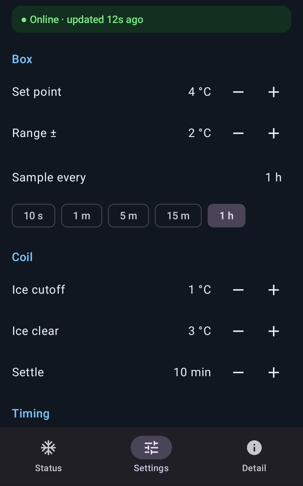
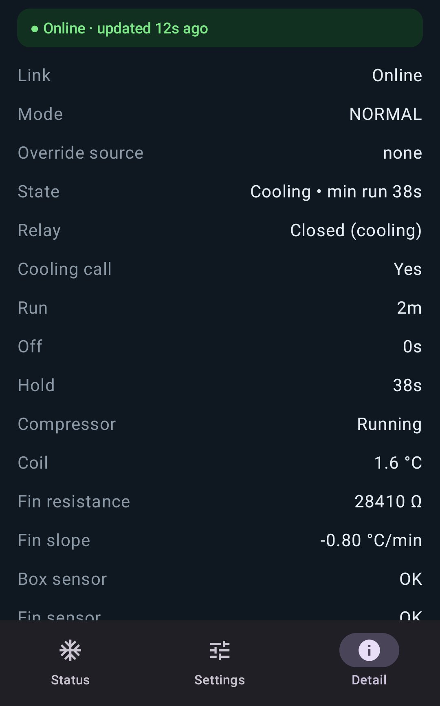
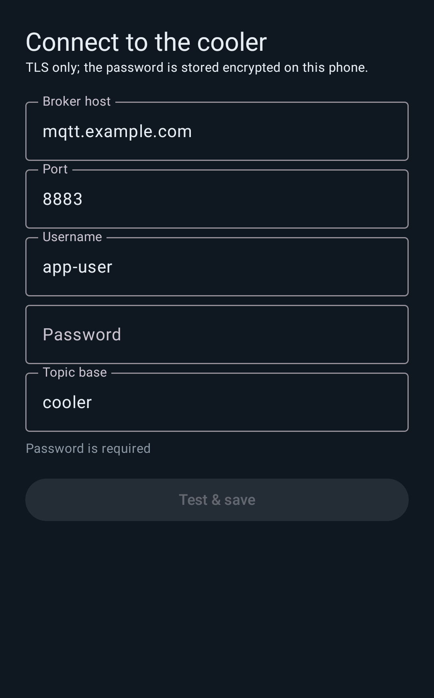

# CoolerApp

Android app for the walk-in cooler (Cooler32). It monitors the cooler and
changes its settings over MQTT, speaking the same contract as the CoolerPanel
wall LCD. Design: `docs/superpowers/specs/2026-09-28-cooler-android-app-design.md`.

- **Status**: box temperature and humidity, run state (same wording as the
  panel), override switch, defrost / fault chips, coil temperature, compressor,
  and a trend of the controller's recent history plus live data.
- **Settings**: the controller's ten settings with the panel's limits. Changes
  are sent after a short pause and confirmed by the controller.
- **Detail**: every status field, fin calibration (start, abort, reset) and the
  broker settings.

The app connects only while it is open. It does not notify; alerts belong in
Node-RED, fed from the retained `cooler/data` and `cooler/availability`.

<p>
  
  
  
  
</p>

The screenshots are rendered from sample data by the `ReadmeScreenshots`
instrumented test (skipped unless asked for):

```bash
./gradlew connectedDebugAndroidTest \
  -Pandroid.injected.androidTest.leaveApksInstalledAfterRun=true \
  -Pandroid.testInstrumentationRunnerArguments.class=ai.northtrail.cooler.ui.ReadmeScreenshots \
  -Pandroid.testInstrumentationRunnerArguments.screenshots=true
adb pull /sdcard/Android/data/ai.northtrail.cooler/files/screenshots/ .
```

## Build and install

```bash
tools/import_ca.sh           # bundles the broker's private CA (git-ignored)
./gradlew testDebugUnitTest  # JVM unit tests
./gradlew installDebug       # to a phone on adb
./gradlew connectedDebugAndroidTest   # UI tests, phone or emulator attached
```

## First run

Enter the broker host, port (8883), the app's username
(`app_mqtt_username`) and its password (`app_mqtt_password` in the git-ignored
`../controller/secrets.yaml`), and topic base `cooler`, then **Test & save**.
The app saves only after it has received `cooler/data`. The password is
encrypted with an Android Keystore key and never shown again.

## Broker account

The app's login on the broker may read `cooler/data` and
`cooler/availability` and write `cooler/cmd`, nothing else.
