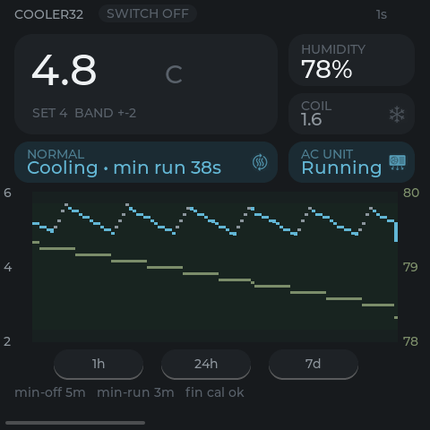
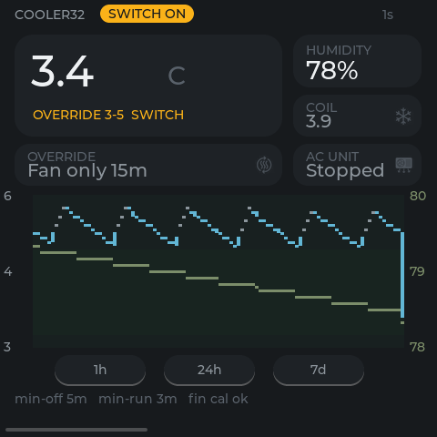
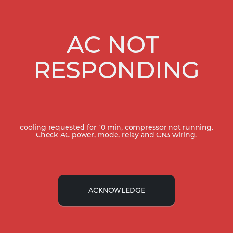
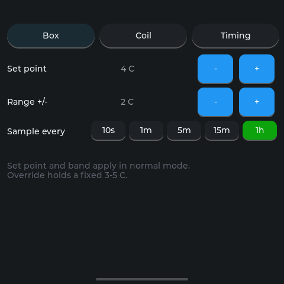
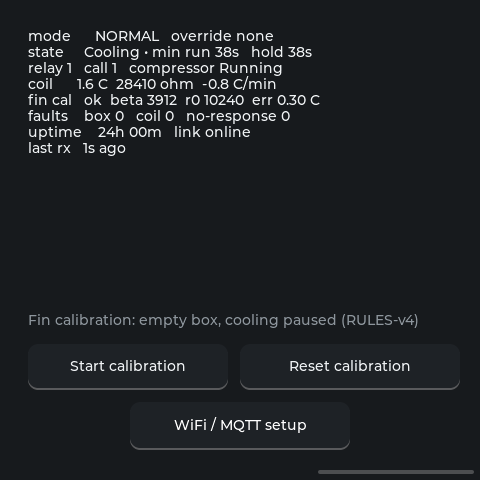
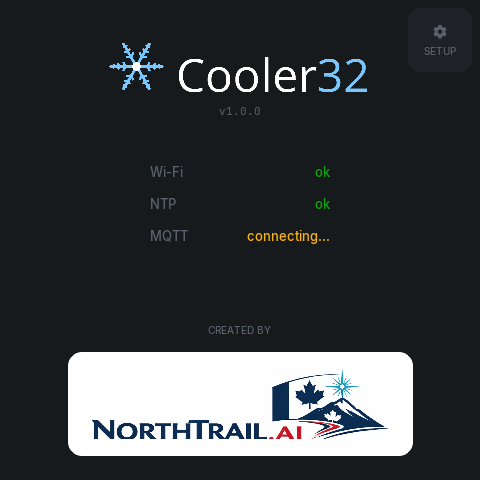

# CoolerPanel

Wall-mounted LCD for the walk-in cooler (Cooler32). It shows the controller's
state and sends setting changes over MQTT (TLS), speaking the same contract as
the CoolerApp Android app. Hardware: **Waveshare ESP32-S3-Touch-LCD-4B**
("Smart 86 Box": 4-inch 480x480 ST7701 RGB panel, GT911 touch,
ESP32-S3-WROOM-1-N16R8). UI: LVGL 9.3 on Arduino/PlatformIO.

- **Trend**: box temperature and humidity, run-state line, override-switch chip,
  coil temperature and AC cards, and a trend of recent history plus live data.
  When Node-RED's `cooler/history` is available (see `../nodered/README.md`), the trend also
  fills in the last 24 hours the panel missed, for example after a reboot.
- **Settings**: the controller's ten settings in Box / Coil / Timing tabs, with limits.
- **Detail**: every status field and fin calibration controls.
- Alarm takeover for faults; night dimming; panel-local settings kept in NVS.

Design docs: `docs/superpowers/specs/2026-08-03-cooler-panel-design.md` and the
plans beside it (the 2026-08-03 documents were written for the v3 dual-AC
controller; `2026-09-26-cooler-panel-v4.md` moves the panel to v4).
Device build and hardware notes: [`device/README.md`](device/README.md).

The portable UI and model code lives in `shared/` and is compiled unchanged by
both the desktop simulator (`sim/`) and the device firmware (`device/`).

## Broker settings

The panel logs in to the cooler broker (port 8883, TLS against the private CA
embedded in the controller config) with its own login (`panel_mqtt_username`). The
broker, login, topic base (`cooler`) and CA are generated from the controller
project, not typed in:

```bash
tools/import_cooler_broker.sh    # reads ../controller/secrets.yaml + cooler-v4.yaml
```

This writes `config/cooler_defaults.h` (git-ignored, it holds the panel
password). Re-run it whenever the broker, the panel login or the CA changes.
The panel's login may read `cooler/data` and `cooler/availability` and write
`cooler/cmd`, nothing else.

## 1. Dependencies (simulator)

```bash
sudo apt-get update && sudo apt-get install -y \
    libsdl2-dev libfreetype6-dev libmosquitto-dev cmake g++
```

LVGL v9.3.0, ArduinoJson and doctest are fetched by CMake (`FetchContent`).
`stb_image`/`stb_image_write` are vendored under `sim/third_party/`.

## 2. Configure and build

Run from the repo root, after `tools/import_cooler_broker.sh`:

```bash
cmake -S . -B build
cmake --build build -j
```

Produces `build/cooler_sim` (the display) and `build/cooler_tests` (unit tests).

## 3. Run against the live broker

```bash
./build/cooler_sim
```

With no arguments the simulator uses the same defaults as the device (the
generated `config/cooler_defaults.h`; port 8883 means TLS with the embedded
CA). Override with `--host`, `--port`, `--user`, `--pass`, `--base`. Panel-local
settings persist in `~/.cooler_panel.json`. Run from the repo root so
`assets/` resolves.

## 4. Tests

```bash
ctest --test-dir build --output-on-failure
```

- **`unit`**: doctest suite for the model, formatting, commands, alarms, chart
  and app wiring (pure logic, no SDL or network).
- **`portability_guard`** (`tests/portability_guard.sh`): greps `shared/` for
  SDL/mosquitto/FreeType/stb symbols and fails if it finds any.

## 5. Screenshots

Headless (no window or X server needed):

```bash
SDL_VIDEODRIVER=dummy ./build/cooler_sim --seed-history \
    --fixture tests/fixtures/data_normal.json --page 0 \
    --frames 1100 --screenshot build/trend.png
```

- `--fixture FILE` routes one captured `/data` payload (plus an `online`
  availability) through `app_on_mqtt_message` and does **not** connect to the
  broker. `tests/fixtures/data_*.json` covers each v4 controller state:
  normal, defrost, override, finproxy, blind, noresponse, calibrating.
- `--seed-history` fills the trend with a synthetic week first.
- `--page 0|1|2` opens Trend / Settings / Detail; `--tab 0|1|2` picks the
  Settings tab (Box / Coil / Timing).
- `--frames N` runs N main-loop iterations (5 ms each) then exits. 1100 clears
  the 4.5 s boot splash.
- `--screenshot PATH` snapshots the screen to a 480x480 PNG on exit.
- `--screen boot|setup|setup-qr` shows the boot or setup screens.
- A fixture with a fault flag raises its alarm takeover, which covers the page.

The README screenshots in `../docs/screenshots/` come from
`tools/capture_screenshots.sh`, which runs these commands for every screen:

<p>
  
  
  
</p>
<p>
  
  
  
</p>

## 6. Portability rule

**Everything under `shared/` may call LVGL and nothing else.** No SDL,
libmosquitto, FreeType, or stb symbols: those are platform concerns and belong
in `sim/` or `device/`. The seam is `platform.h` (`platform_now_ms`,
`platform_epoch_utc`, `link_state_t`); each platform implements it.
`tests/portability_guard.sh` (run by `ctest`) enforces this on every build.
