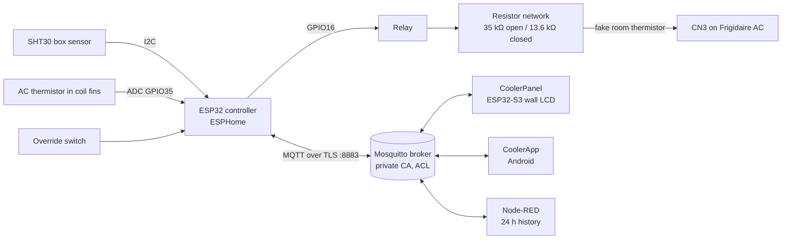
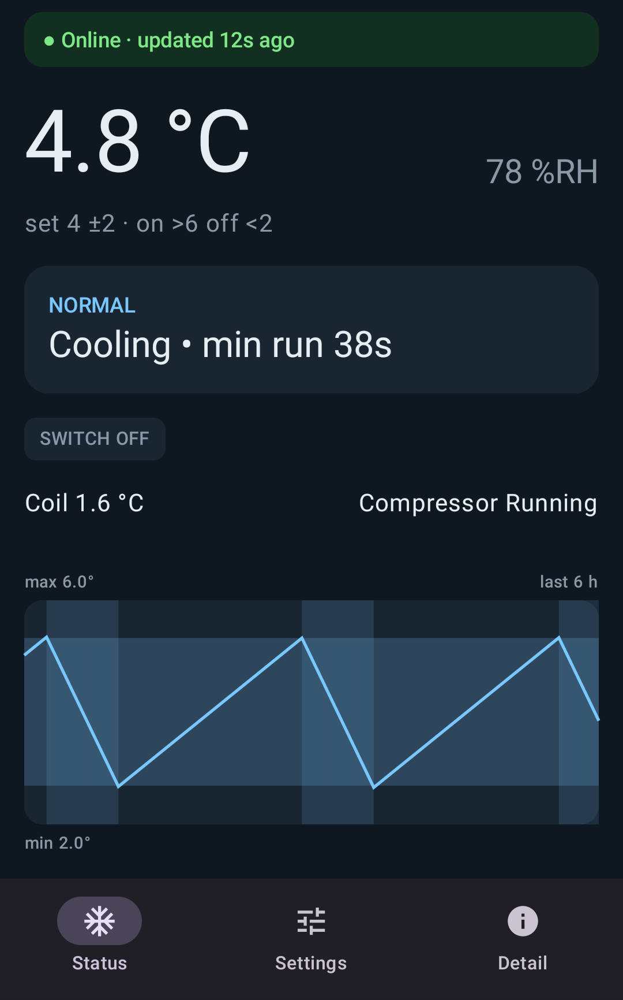
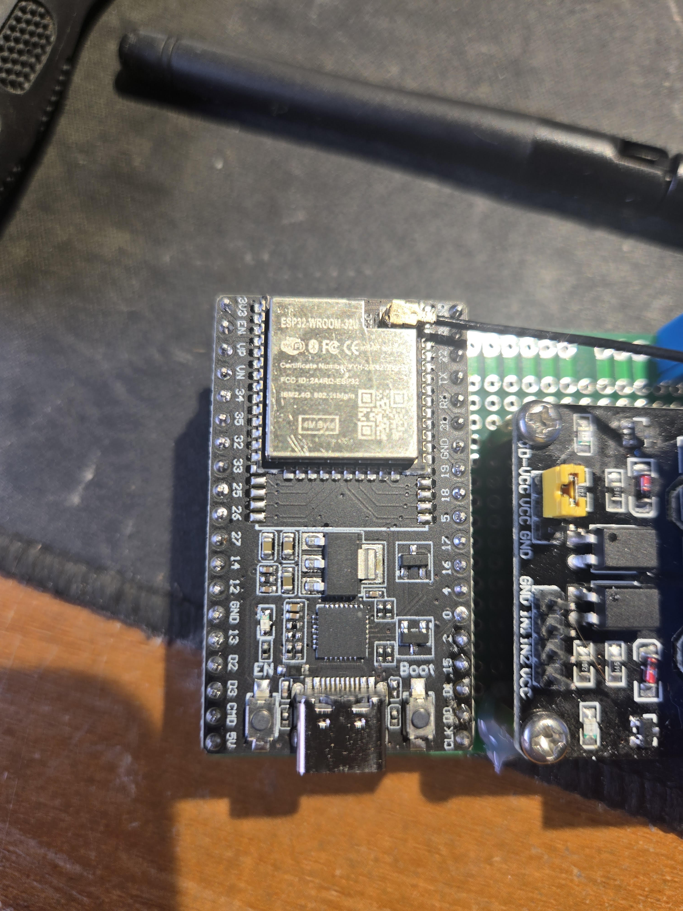
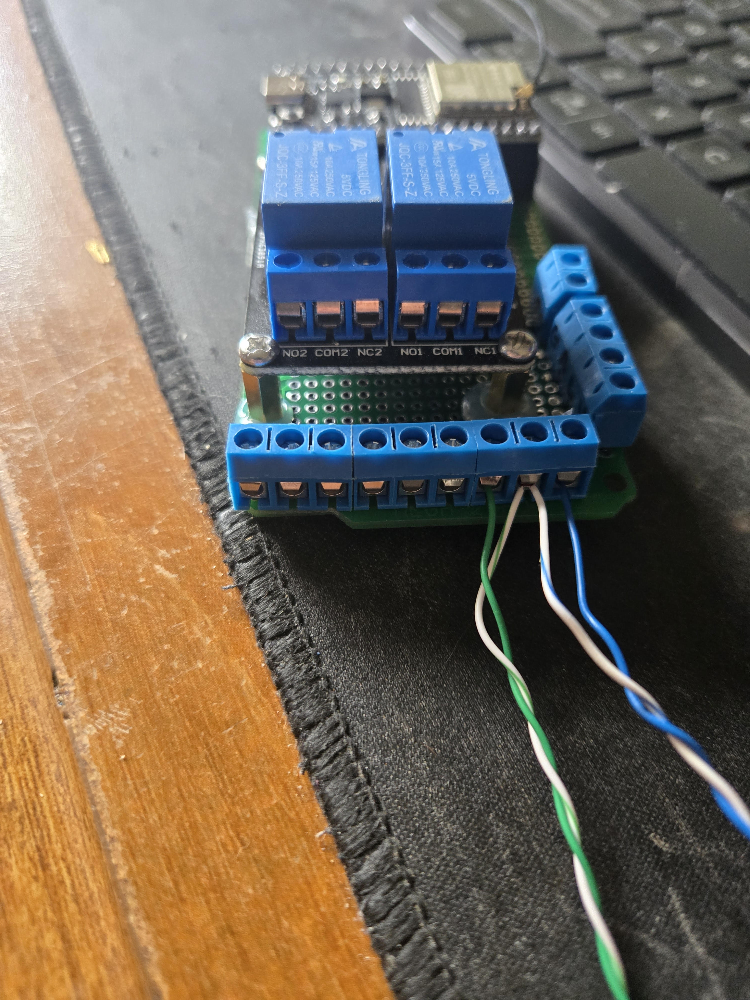

# CoolerBot32: walk-in cooler controller

An ESP32 (ESPHome) keeps a walk-in cooler ("Cooler32") at temperature using a single Frigidaire window AC. The ESP32 never switches compressor power. It fakes the AC's room thermistor at the AC's CN3 connector, using a resistor network switched by one relay, so the AC's own board decides when to cool. The controller adds icing (defrost) protection, timing protections, sensor-failure fallbacks and an override switch. It reports over MQTT (TLS) to a wall LCD (CoolerPanel) and an Android app (CoolerApp).



## Screenshots

<table>
  <tr>
    <td align="center"><br>Wall panel (480×480)</td>
    <td align="center"><br>Android app</td>
  </tr>
</table>

More in [docs/screenshots](docs/screenshots/): panel trend in override and defrost, alarm takeovers, settings tabs, detail and boot screens; app settings, detail and setup. They are rendered from sample data, not a live cooler.

## How the CN3 trick works

The AC reads its room temperature from a thermistor on connector CN3. The thermistor is unplugged and a resistor network goes in its place: 35 kΩ is always across CN3, and a 22 kΩ resistor is added in parallel through the relay.

| Relay | Resistance at CN3 | AC sees | AC does |
|---|---|---|---|
| open | 35 kΩ | about -1 °C | stops cooling |
| closed | 13.6 kΩ | about 18 °C | cools |

The AC is set to Cool, fan continuous, at its minimum setpoint (about 16 °C), which sits between the two fake temperatures. The AC keeps its own compressor protection. The original thermistor is reused as a coil ("fin") sensor on the ESP32. Nothing on the CN3 side touches the ESP32. The relay is open through boot, reset and OTA.

## Hardware

- ESP32-WROOM-32U DevKit (CP2102 USB), ESPHome board `esp32dev`, esp-idf framework (needed for MQTT TLS)
- 2-channel 5 V relay board (JD-VCC jumper removed), only channel 1 used for cooling
- SHT30 box temperature and humidity sensor
- Frigidaire AC's original thermistor, moved into the coil fins, plus a 32 kΩ pull-up (22 kΩ + 10 kΩ)
- 6-position terminal block with the 35 kΩ and 22 kΩ resistors, latching override switch, status LED with 330 Ω

| Function | GPIO | Notes |
|---|---|---|
| Cooling relay (IN1) | 16 | inverted, off at boot |
| Other relay (IN2) | 19 | unused, held off |
| Override switch | 21 | to GND, internal pull-up, 50 ms debounce |
| Status LED | 32 | |
| SHT30 SDA / SCL | 33 / 22 | I2C 0x44, 10 kHz (100 kHz failed on its cable), read every 10 s |
| Coil thermistor | 35 | ADC, 12 dB, 3V3 - 32 kΩ - GPIO35 - thermistor - GND |

Not usable on this board: GPIO 5, 12, 14, 17, 18, 23, 25, 26, 27.

Full schematic and terminal-block diagrams: [V4_Wiring/index.html](V4_Wiring/index.html) (open in a browser) or [V4_Wiring/cooler-v4-wiring.pdf](V4_Wiring/cooler-v4-wiring.pdf).




## Control behaviour

| Mode | When | Cooling decision |
|---|---|---|
| normal | box sensor healthy | on above `coolerset + range`, off below `coolerset - range` |
| override | override switch closed, or MQTT link lost for 60 s | fixed: on at 5 °C, off at 3 °C |
| fin-proxy | box sensor failed | coil stands in for the box: runs up to `maxrun`, then rests at least `settle` |
| override-proxy | override and box sensor failed | fin-proxy cycle with the 5 / 3 °C thresholds |
| blind | both sensors failed | timed: `dutypercent` of every `maxrun` window |

Protections, in every mode:

- **Defrost / fin lockout**: coil at or below `fin_cutoff` opens the relay (the fan keeps running) until the coil reaches `fin_recover`, or matches the box for 2 min.
- **Minimum run** and **minimum off** times.
- **Timed backup duty** while the fin sensor is faulted.
- Compressor running is inferred from the coil temperature slope. "AC not responding" fires after 10 min with the relay closed and no compressor.

Status LED: fast blink = sensor fault or no response, slow blink = defrost, solid = cooling requested, off otherwise.

Settings (integers, persisted, clamped in `controller/cooler_logic.h`):

| Key | Unit | Range | Default |
|---|---|---|---|
| `coolerset` | °C | 2 .. 40 | 4 |
| `range` | °C | 0 .. 5 | 2 |
| `fin_cutoff` | °C | -5 .. 5 | 1 |
| `fin_recover` | °C | `fin_cutoff`+1 .. 10 | 3 |
| `settle` | min | 2 .. 30 | 10 |
| `minofftime` | min | 0 .. 30 | 5 |
| `minruntime` | s | 0 .. 600 | 180 |
| `maxrun` | min | 1 .. 60 | 10 |
| `dutypercent` | % | 1 .. 100 | 50 |
| `sampleinterval` | s | 10 .. 3600 | 3600 |

## MQTT contract

Broker port 8883 with TLS, using a private CA embedded in `controller/cooler-v4.yaml` (`certificate_authority`). Mosquitto with password and ACL files. Home Assistant discovery is off.

| Topic | Direction | Payload |
|---|---|---|
| `cooler/data` | controller publishes, retained | JSON, `"v": 2`, every 30 s and on any change |
| `cooler/availability` | controller publishes, retained | `online` / `offline` (last will) |
| `cooler/cmd` | clients publish | JSON, any of the ten settings above as integers, plus `{"calibrate":1}` / `{"calibrate":0}`, `{"fincal_reset":1}`, `{"clearhist":1}` |
| `cooler/history` | Node-RED publishes, not retained | JSON, `"v": 1`, the last 24 h in one-minute slots, after every live `cooler/data`; see [nodered/README.md](nodered/README.md) |
| `cooler/binary_sensor/override_switch/state` | controller publishes | `ON` / `OFF` |

| Login | Used by | ACL |
|---|---|---|
| the controller's login (`mqtt_username`) | controller | read/write `cooler/#` |
| the panel's login (`panel_mqtt_username`) | CoolerPanel | read `cooler/data`, `cooler/availability`, `cooler/history`; write `cooler/cmd` |
| the app's login (`app_mqtt_username`) | CoolerApp | same as the panel's |
| Node-RED's login | Node-RED | read `cooler/data`, `cooler/availability`; write `cooler/history` |

Passwords live only in the git-ignored `controller/secrets.yaml`.

## Getting started

1. `cp controller/secrets.yaml.example controller/secrets.yaml` and fill it in (Wi-Fi, OTA/AP passwords, `mqtt_broker`, and the three MQTT logins). Never commit it.
2. Build and flash (ESPHome 2025.2): `esphome run controller/cooler-v4.yaml`
3. Bench test configs: `controller/relay-test.yaml` (the two relays, with an auto-cycle) and `controller/i2c-diag.yaml` (I2C scan and SHT30).
4. Host unit tests for the control logic (doctest, 49 cases):
   ```bash
   cd controller
   cmake -S tests -B build && cmake --build build -j && ctest --test-dir build --output-on-failure
   ```
5. Before connecting to the AC, follow the install checklist in [RULES-v4.md](RULES-v4.md): AC timing test, then fin calibration.

## Companion projects

Folders in this repository:

- **CoolerPanel/** - Waveshare ESP32-S3 Smart 86 wall LCD (LVGL 9.3, Arduino/PlatformIO) with a desktop simulator. See [CoolerPanel/README.md](CoolerPanel/README.md).
- **CoolerApp/** - Android app (Kotlin, Compose, HiveMQ client) for monitoring and settings; no notifications. See [CoolerApp/README.md](CoolerApp/README.md).
- **nodered/** - Node-RED flow that keeps 24 h of history and republishes it on `cooler/history`. See [nodered/README.md](nodered/README.md). Alerts are still planned.

## Repository layout

```
controller/        ESPHome firmware: cooler-v4.yaml, cooler_logic.h, cooler_esphome.h,
                   relay-test.yaml, i2c-diag.yaml, secrets.yaml.example, tests/ (host tests)
V4_Wiring/         wiring page (index.html), PDF export, photos/
docs/screenshots/  panel and app screenshots (sample data)
docs/superpowers/  design specs and implementation plans (dated, historical)
RULES-v4.md        current rules, hardware, settings, install checklist
RULES.md           legacy v3 dual-AC rules
fridigaire.md      original design conversation
CoolerPanel/       ESP32-S3 wall LCD firmware and desktop simulator
CoolerApp/         Android app
nodered/           Node-RED 24 h history flow (history.js, build-flow.mjs, tests)
LICENSE            MIT
```

## Project status

Done and bench-verified: relays (off through boot), override switch and LED, SHT30, coil thermistor (within about 0.1 °C of the SHT30), AC resistor block (35 kΩ open / 13.6 kΩ closed), controller MQTT over TLS, CoolerPanel on the broker with a working command round-trip, and an ice-pack test on 2026-09-28 covering cooling thresholds, min run and min off, and defrost trip and recovery (which led to the `fin_cutoff` default of 1 °C). CoolerApp is built and its APK is on the phone.

To do:

1. Set the Frigidaire: Cool, fan continuous, setpoint at its minimum (about 16 °C).
2. Move the thermistor into the coil fins; connect terminal block 1-2 to CN3 (AC unplugged).
3. Run the install checklist in RULES-v4.md: AC timing test, then fin calibration.
4. Set `coolerset` back to 4 °C for real use (the bench controller is at 12).
5. Check CoolerApp on the phone.
6. Alerts in Node-RED.

## Documentation

- [RULES-v4.md](RULES-v4.md) - current rules, hardware, modes, settings, MQTT, install checklist
- [V4_Wiring/index.html](V4_Wiring/index.html) and [PDF](V4_Wiring/cooler-v4-wiring.pdf) - wiring and progress
- [Controller design spec](docs/superpowers/specs/2026-09-26-single-relay-controller-design.md) and [plan](docs/superpowers/plans/2026-09-26-single-relay-controller.md)
- [fridigaire.md](fridigaire.md) - the original design discussion
- [RULES.md](RULES.md) - legacy v3 dual-AC rules (retired)

## License

MIT, see [LICENSE](LICENSE).
